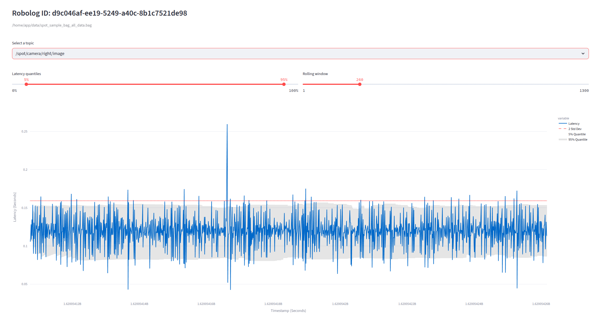
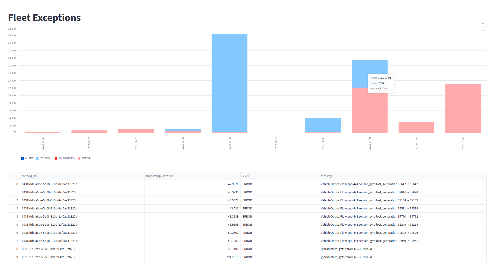

<p align="center">
  
</p>

---

# Bagel: Bag Extraction Tool

Bagel allows you to extract, transform, and analyze robotics data — fast.

Whether you're performing granular robot-level troubleshooting, analyzing fleet-wide performance metrics, or creating high-level executive dashboards, Bagel gets the job done.

[Get started today](#getting-started) — no account needed.

### A Sneak Peek

Bagel can visualize camera latency from a robolog:

<p align="center">
  
</p>

...or aggregate fleet-level exceptions over time:

<p align="center">
  
</p>

### Log Formats

Bagel is designed to ingest a wide range of common robotics and sensor log formats out of the box.

| Format                         | Supported Encodings        |
| ------------------------------ | -------------------------- |
| ✅ **ROS 2** (`.mcap`, `.db3`) | `ros1`, `ros2`, `protobuf` |
| ✅ **ROS 1** (`.bag`)          | `ros1`                     |
| ✅ **PX4** (`.ulg`)            | `ULog`                     |

#### Don’t See Your Format?

Bagel is built to be extensible. If your preferred format isn’t listed, we encourage you to **[open a feature request](https://github.com/shouhengyi/bagel/issues)** to start a discussion!

## Getting Started

### Running in Docker 🐳

To run Bagel without installing local dependencies like ROS, you can use our provided Docker images. This example uses ROS 2 Kilted.

#### Mount Your Data

First, give the container access to your robolog files. Open the compose.yaml file and find the service you want to use (e.g., ros2-kilted). Edit the volumes section to link your local data folder to the container's data folder.

```yaml
services:
  ros2-kilted:
    ...
    # volumes:                                     <-- ✅ Uncomment
    #   - <path-to-local-data>:/home/ubuntu/data   <-- ✅ Uncomment & Replace
```

#### Launch the App

Build and start the container with a single command.

```sh
docker compose up --build ros2-kilted
```

For future runs, you can omit the --build flag.

Your local robolog files are now accessible inside the container at `/home/ubuntu/data`.

### Running Locally 🛠️

If local dependencies like ROS are already installed, you can directly run Bagel on your machine.

#### Prerequisites

First, ensure you have the following tools installed:

- [Python 3.10+](https://www.python.org/downloads/)
- [Docker Desktop](https://docs.docker.com/desktop/)
- [Poetry](https://python-poetry.org/docs/)

#### Install & Run

Next, use Poetry to install the project dependencies and run the application.

```sh
poetry install
poetry run python3 main.py up
```
