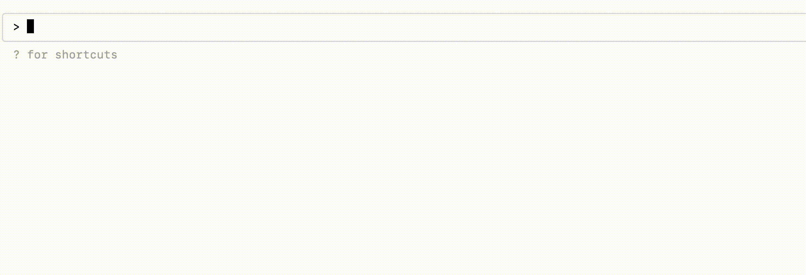

<p align="center">
  <picture>
    <source media="(prefers-color-scheme: dark)" srcset="./doc/assets/bagel_logo_dark_mode.png">
    
  </picture>
</p>

<h1 align="center">
  <a href="https://github.com/shouhengyi/bagel/blob/stage/LICENSE">
    
  </a>
  <a href="https://discord.gg/QJDwuDGJsH">
    
  </a>
</h1>

---

Bagel lets you chat with your robotics data.

For example, you can ask Bagel to check a PX4 drone's IMU data for hard landings:

<p align="center">
  <picture>
    
  </picture>
</p>

Bagel can also propose fixes for detected errors in your robot:

<p align="center">
  <picture>
    
  </picture>
</p>

Bagel works with a wide range of common robotics and sensor log formats out of the box. Don't see your format? [Open a ticket](https://github.com/shouhengyi/bagel/issues).

| Format                         |
| ------------------------------ |
| ✅ **ROS 2** (`.mcap`, `.db3`) |
| ✅ **ROS 1** (`.bag`)          |
| ✅ **PX4** (`.ulg`)            |

## Quickstart

We are using ROS2 Kilted and Claude Code as example.

```sh
source /opt/ros/kilted/setup.sh  # Source ROS2 dependencies
uv sync --group ros2             # Install PyPI packages
uv run main.py up mcp            # Start Bagel MCP server
```

Open another terminal and run:

```sh
# Add Bagel MCP server to Claude Code
claude mcp add --transport sse bagel http://localhost:8000/sse

# Launch Claude Code
claude

# Happy prompting
> Summarize the metadata of robolog "./doc/tutorials/data/ros2".
```

The Bagel MCP server is **not exclusively tied to Claude**. You're free to integrate your
preferred LLMs with Bagel.

### Tutorials

- [MCP Tutorial - Claude Code](./doc/tutorials/mcp/0_claude_code_px4.ipynb)
- [MCP Tutorial - Gemini CLI](./doc/tutorials/mcp/1_gemini_cli_ros2.ipynb)
- [Build a Data Pipeline from a PX4 ULog](./doc/tutorials/pipelines/0_basics.ipynb)
- [Read Topic Messages from a ROS 2 Bag](./doc/tutorials/readers/1_read_by_topic.ipynb)

### Running in Docker 🐳

To run Bagel without installing local dependencies like ROS, you can use our provided Docker images. Make sure you have [Docker Desktop](https://docs.docker.com/desktop/) installed. This example uses ROS 2 Kilted.

#### Mount Your Data

First, give the container access to your robolog files. Open the [compose.yaml](./compose.yaml) file and find the service you want to use (e.g., ros2-kilted). Edit the volumes section to link your local data folder to the container's data folder.

```yaml
services:
  ros2-kilted:
    ...
    # volumes:                                     <-- ✅ Uncomment
    #   - <path-to-local-data>:/home/ubuntu/data   <-- ✅ Uncomment & Replace
```

Your local robolog files will be accessible inside the container at `/home/ubuntu/data`.

#### Launch the MCP Server

Build and start the Bagel MCP server in a container with this command.

```sh
docker compose run --build --service-ports ros2-kilted uv run main.py up mcp
```
